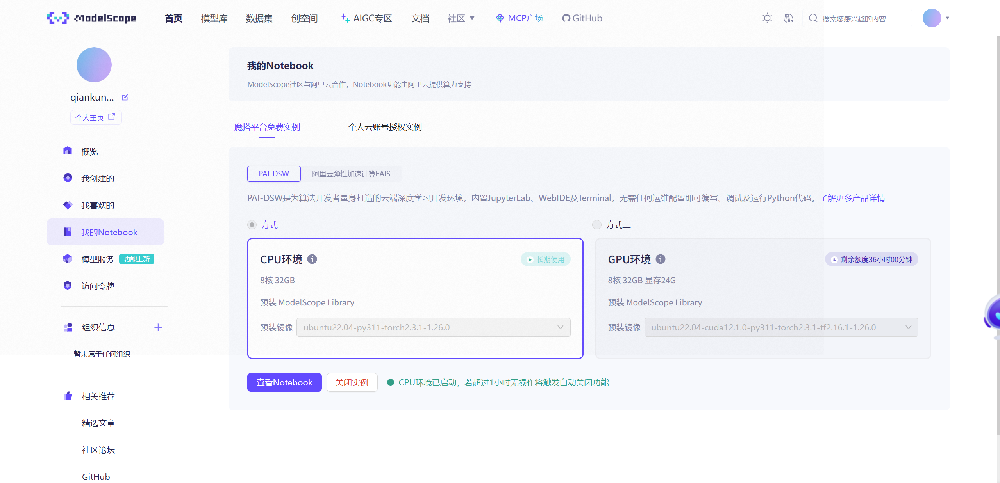
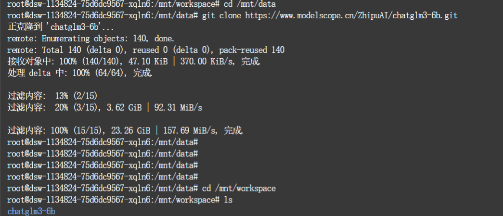

# AI-Intro-HW4

本项目对三个主流开源大语言模型进行了部署、测试与横向对比分析。

## 对比分析的模型

- **通义千问 Qwen-7B-Chat**（阿里巴巴）
- **智谱 ChatGLM3-6B**（清华大学 KEG 实验室）
- **DeepSeek-LLM-7B-Chat**（DeepSeek 团队）

## 详细分析文档位置

- 详细分析与测试报告（推荐阅读）：
  - [hw-4/llm_deployment_report1.1.md](hw-4/llm_deployment_report1.1.md)
  - [hw-4/llm_deployment_report1.1.pdf](hw-4/llm_deployment_report1.1.pdf)
- 项目根目录还包含：
  - [llm_deployment_report1.1.pdf](llm_deployment_report1.1.pdf)
  - [任务要求.docx](任务要求.docx)

## 可视化图片与结果

所有实验截图和可视化图片均存放于 [hw-4/](hw-4/) 文件夹下，例如：

- 
- 
- ...
- 你可以在 [hw-4 文件夹](https://github.com/qiankun25/AI-Intro-HW4/tree/main/hw-4) 查看全部图片

## 说明

- 对比分析的详细内容、实验流程、评价指标和结论详见 `hw-4/llm_deployment_report1.1.md` 或 PDF 文件。
- 图片文件（如 image-1.png, image-2.png 等）用于直观展示不同模型在各项指标下的表现。
- 如果需要查看更多图片或文件，请访问 [hw-4 文件夹](https://github.com/qiankun25/AI-Intro-HW4/tree/main/hw-4)。

## 其他

- 任务要求和作业说明见根目录下的 `任务要求.docx` 文件。
