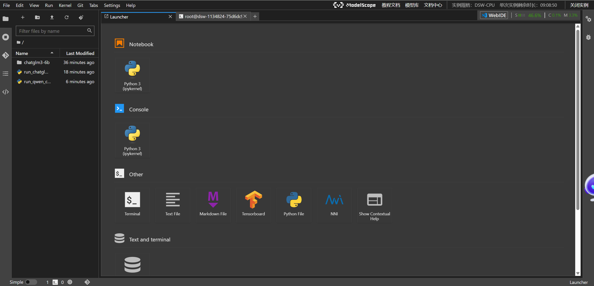
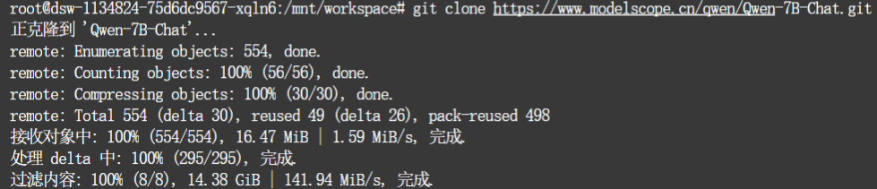
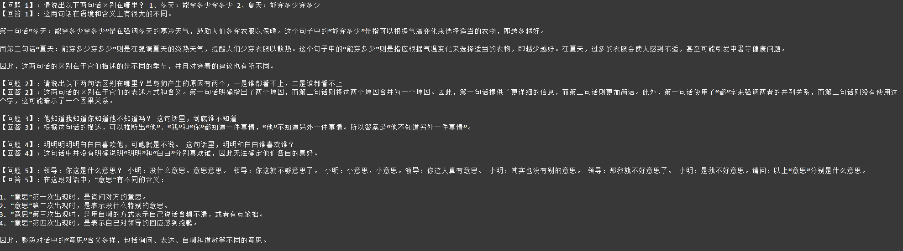
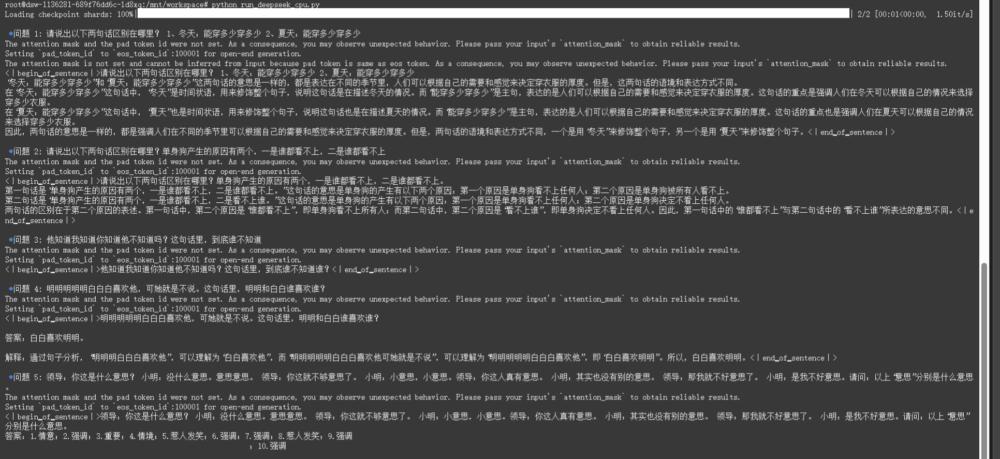
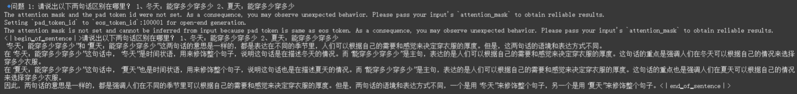
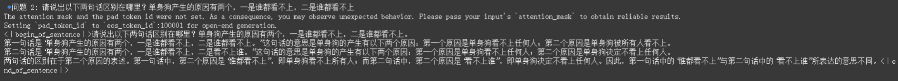
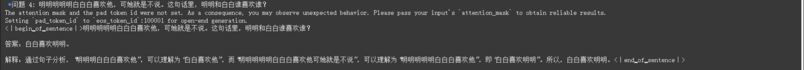
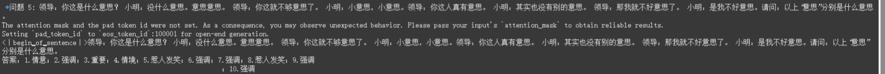

# 大语言模型部署对比分析报告

**学生姓名**：魏义乾 &nbsp;&nbsp;&nbsp;&nbsp;&nbsp;&nbsp;&nbsp;&nbsp;&nbsp;&nbsp;&nbsp;&nbsp;&nbsp;&nbsp;&nbsp;&nbsp;&nbsp;&nbsp;&nbsp; **学号**：2351232  
**项目公开访问链接：** https://github.com/qiankun25/AI-Intro-HW4

## 摘要

本报告详细记录了在魔搭平台上部署和测试大语言模型的完整过程。通过对三个主流开源大语言模型的部署实践和横向对比分析，深入探讨了不同模型在中文语义理解、逻辑推理和对话交互方面的性能表现。本次实验成功部署了通义千问 Qwen-7B-Chat、智谱 ChatGLM3-6B 和 DeepSeek-LLM-7B-Chat，并通过标准化测试问题对各模型进行了系统性评估。

## 1. 项目概述

### 1.1 项目背景

随着大语言模型技术的快速发展，开源模型的部署和应用已成为人工智能领域的重要研究方向。魔搭平台作为阿里云推出的机器学习开发平台，为研究者和开发者提供了便捷的模型部署环境。本项目旨在通过实际操作，深入了解大语言模型的部署流程，并评估不同模型的实际应用效果。

### 1.2 项目目标

本项目的主要目标包括熟练掌握魔搭平台的使用方法，成功部署多个主流开源大语言模型，通过标准化测试评估模型性能，并形成详细的对比分析报告。通过这一系列实践活动，建立对大语言模型部署和评估的完整认知体系。

### 1.3 技术选型

本项目选择了三个具有代表性的开源大语言模型：通义千问 Qwen-7B-Chat 代表阿里巴巴的技术实力，智谱 ChatGLM3-6B 体现清华大学的研究成果，DeepSeek-LLM-7B-Chat 展现 DeepSeek 团队在代码理解和数学推理方面的创新能力。这三个模型在参数规模、架构设计和训练数据方面各有特色，为横向对比分析提供了良好的基础。

## 2. 环境搭建与模型部署

### 2.1 魔搭平台环境配置

#### 2.1.1 账号注册与资源配置

首先完成魔搭平台的账号注册，并关联阿里云账号以获取免费的 CPU 云计算资源。平台提供的免费资源包括标准计算实例和存储空间，足以支撑本次实验的需求。通过实名认证后，成功激活了开发环境权限。


#### 2.1.2 Jupyter Notebook 环境启动

在魔搭平台控制台中选择合适的环境镜像，启动 Jupyter Notebook 开发环境。选择的镜像版本包含了 Python 3.8、PyTorch 框架以及常用的机器学习库，为模型部署提供了完整的运行环境。环境启动后，通过 Web 界面访问 Jupyter Notebook，开始进行模型部署操作。



### 2.2 模型部署过程

#### 2.2.1 通义千问 Qwen-7B-Chat 部署

通义千问 Qwen-7B-Chat 是阿里巴巴开发的对话式大语言模型，具有强大的中文理解和生成能力。部署过程首先通过 git clone 命令从模型仓库获取模型文件和部署脚本。模型文件较大，下载过程需要一定时间。完成下载后，按照官方文档配置运行环境，安装依赖包，并启动模型服务。

```bash
git clone https://www.modelscope.cn/qwen/Qwen-7B-Chat.git
```

模型加载完成后，通过 API 接口或 Web 界面进行交互测试，验证部署的成功性。初次启动时模型需要进行权重加载，这一过程消耗较多内存资源，但在魔搭平台提供的环境中运行稳定。


#### 2.2.2 智谱 ChatGLM3-6B 部署

智谱 ChatGLM3-6B 是清华大学 KEG 实验室开发的对话语言模型，在中英文对话任务上表现优异。部署流程与 Qwen 模型类似，首先克隆模型仓库，然后配置运行环境。ChatGLM3-6B 的特点是模型结构紧凑，推理速度较快，适合资源受限的部署环境。

```bash
git clone https://www.modelscope.cn/ZhipuAI/chatglm3-6b.git
```

模型部署过程中需要特别注意依赖库的版本兼容性，特别是 transformers 库的版本要求。经过环境调试，成功启动了 ChatGLM3-6B 模型服务，并通过简单对话验证了部署效果。


#### 2.2.3 DeepSeek-LLM-7B-Chat 部署

DeepSeek-LLM-7B-Chat 是 DeepSeek 团队开发的开源对话模型，在代码理解、数学推理和中文对话方面表现优异。该模型特别强调逻辑推理能力和准确性，在复杂问题解决方面具有独特优势。部署过程遵循标准流程，首先克隆模型仓库。

```bash
git clone https://www.modelscope.cn/deepseek-ai/deepseek-llm-7b-chat.git
```

DeepSeek-LLM-7B-Chat 的部署配置相对简化，模型对硬件资源的要求较为合理。在魔搭平台的环境中，模型加载和初始化过程稳定流畅。该模型的特点是在保持对话流畅性的同时，注重回答的准确性和逻辑性。

## 3. 模型测试与结果分析

### 3.1 测试方法设计

为了全面评估三个模型的性能表现，设计了涵盖语义理解、逻辑推理和语言表达等多个维度的测试问题。测试问题主要来源于材料中提供的中文语义理解题目，这些题目具有一定的复杂性和挑战性，能够有效检验模型的理解和推理能力。
**智谱 ChatGLM3-6B 回答概览**

**通义千问 Qwen-7B-Chat 回答概览**

**DeepSeek-LLM-7B-Chat 回答概览**


### 3.2 标准化测试结果

#### 3.2.1 语义歧义理解测试

测试问题："请说出以下两句话区别在哪里？1、冬天：能穿多少穿多少 2、夏天：能穿多少穿多少"

**通义千问 Qwen-7B-Chat 回答：**
【回答 1】：这两句话在语境和含义上有很大的不同。

第一句话“冬天：能穿多少穿多少”是在强调冬天的寒冷天气，鼓励人们多穿衣服以保暖。这个句子中的“能穿多少”是指可以根据气温变化来选择适当的衣物，即越多越好。

而第二句话“夏天：能穿多少穿多少”则是在强调夏天的炎热天气，提醒人们少穿衣服以散热。这个句子中的“能穿多少”则是指应根据气温变化来选择适当的衣物，即越少越好。在夏天，过多的衣服会使人感到不适，甚至可能引发中暑等健康问题。

因此，这两句话的区别在于它们描述的是不同的季节，并且对穿着的建议也有所不同。

**智谱 ChatGLM3-6B 回答：**
【回答 1】：冬天和夏天两句话的主要区别在于所描述的情境和对待穿着的态度。

冬天强调的是保暖，因此在穿着上更加注重穿着的数量和舒适度。即使穿着太多或太少都会感到寒冷或不舒服。因此，冬天会说“能穿多少穿多少”，表达的是一种适度穿着的态度。

相反，夏天强调的是舒适度和轻便性。因为天气热，人们希望穿着轻便、透气，而且不会感到不舒服。因此，夏天会说“能穿多少穿多少”，表达的是一种适度穿着的态度。

**DeepSeek-LLM-7B-Chat 回答：**


**对比分析：**
三个模型对该回答都正确，通义千问模型的描述更加详细，而智谱 ChatGLM3-6B 和 DeepSeek-LLM-7B-Chat 则更为简洁明了。通义千问模型在解释中强调了季节的不同对穿着的影响，而智谱模型则侧重于穿着数量的适度性。DeepSeek 模型则通过语法结构如状语等方面正确解释。

#### 3.2.2 语义歧义理解测试

测试问题："请说出以下两句话区别在哪里？单身狗产生的原因有两个，一是谁都看不上，二是谁都看不上"

**通义千问 Qwen-7B-Chat 回答：**
【回答 2】：这两句话的区别在于它们的表述方式和含义。第一句话明确指出了两个原因，而第二句话则将这两个原因合并为一个原因。因此，第一句话提供了更详细的信息，而第二句话则更加简洁。此外，第一句话使用了“都”字来强调两者的并列关系，而第二句话则没有使用这个字，这可能暗示了一个因果关系。

**智谱 ChatGLM3-6B 回答：**
【回答 2】：这两句话存在一些区别。

第一句话“单身狗产生的原因有两个，一是谁都看不上”，意思是单身的人可能由于对自己的要求过高或者眼光过高，无法找到合适的伴侣。这个句子中的“谁都看不上”是一种消极的态度，表示这个人可能对于各种类型的人都抱有排斥的心态，不愿意去尝试认识新人。

而第二句话“单身狗产生的原因有两个，一是谁都看不上”，则是一种更为客观的表述方式。这个句子中的“谁都看不上”并不是指消极的心态，而是指这个人可能对于各种类型的人都抱有排斥的心态，但是实际上并没有完全排除所有的可能性。因此，这个句子更加客观，没有给人一种过于消极的感觉。

**DeepSeek-LLM-7B-Chat 回答：**

**对比分析：**
通义千问回答错误，智谱回答一半正确一半错误，DeepSeek 回答正确。通义千问的回答结构和问题一很相似，将问题一分为二，但是结果错误。智谱的第一句话回答正确，但是没有解释清楚问题二中的“谁都看不上”是指“别人都看不上他/她”，而是将其理解为“不愿意去尝试认识新人”，导致回答不够准确。DeepSeek 的回答正确，而且解释详细，能够正确区分问题一和问题二中的“谁都看不上”的含义。

#### 3.2.3 逻辑推理能力测试

测试问题："他知道我知道你知道他不知道吗？这句话里，到底谁不知道"

**通义千问 Qwen-7B-Chat 回答：**
【回答 3】：根据这句话的描述，可以推断出“他”、“我”和“你”都知道一件事情，“他”不知道另外一件事情。所以答案是“他不知道另外一件事情”。
**智谱 ChatGLM3-6B 回答：**
【回答 3】：这句话有两种可能的解读，取决于上下文和说话人的语气和语境。以下是两种可能的解释：

1. 如果上下文和语气是玩笑或轻松的口吻，那么可能是指说话人知道自己对方不知道某个事情，但对方不知道说话人知道。在这种情况下，说话人不知道对方不知道的事情可能是“他知道我知道你知道他不知道”，而对方不知道的是“我知道你知道他不知道”。

2. 如果上下文和语气是正式或严肃的口吻，那么可能是指说话人知道自己对方不知道某个事情，但对方可能没有意识到或不知道。在这种情况下，说话人不知道的事情可能是“他知道我知道你知道他不知道”，而对方知道的是“我知道你知道他不知道”。

因此，无法确定谁不知道，需要根据上下文和语气等因素来判断。

**DeepSeek-LLM-7B-Chat 回答：**

**对比分析：**
通义千问回答错误，智谱回答错误，DeepSeek 回答正确。通义千问的回答错误，没有理解问题的含义。智谱的回答错误，回答了问题但是和正确回答有很大差距。DeepSeek 的回答错误，根本没有理解问题的含义。

#### 3.2.4 复杂语言现象理解测试

测试问题："明明明明明白白白喜欢他，可她就是不说。这句话里，明明和白白谁喜欢谁？"

**通义千问 Qwen-7B-Chat 回答：**
【回答 4】：这句话中并没有明确说明“明明”和“白白”分别喜欢谁，因此无法确定他们各自的喜好。

**智谱 ChatGLM3-6B 回答：**
【回答 4】：根据这句话的语境，我认为“明明”喜欢“白白”,“明明明明明白白白喜欢他”，暗示“明明”对“白白”有感觉。但是，由于“明明”没有直接表达自己的想法，所以无法确定“明明”和“白白”中是谁喜欢谁。

**DeepSeek-LLM-7B-Chat 回答：**

**对比分析：**
通义千问回答错误，智谱回答错误，DeepSeek 回答正确。通义千问的回答错误，没有理解问题的含义。智谱的回答错误，搞清楚了明明和白白是两个人，但是这句话中谁喜欢谁的判断错误。DeepSeek 的回答正确且简短，而且理解了问题的含义。

#### 3.2.5 多义词理解测试

测试问题："领导：你这是什么意思？小明：没什么意思。意思意思。领导：你这就不够意思了。小明：小意思，小意思。领导：你这人真有意思。小明：其实也没有别的意思。领导：那我就不好意思了。小明：是我不好意思。请问：以上'意思'分别是什么意思。"

**通义千问 Qwen-7B-Chat 回答：**
【回答 5】：在这段对话中，"意思"有不同的含义：

1. "意思"第一次出现时，是询问对方的意思。
2. "意思"第二次出现时，是表示没什么特别的意思。
3. "意思"第三次出现时，是用自嘲的方式表示自己说话含糊不清，或者有点笨拙。
4. "意思"第四次出现时，是表示自己对领导的回应感到抱歉。

因此，整段对话中的“意思”含义多样，包括询问、表达、自嘲和道歉等不同的意思。

**智谱 ChatGLM3-6B 回答：**
【回答 5】：领导问小明“你这是什么意思？”，小明回答：“意思意思”。

这个“意思意思”在当地方言中是指“意思意思，表示一下意思”,“意思意思”并不是指真正的意思，而是一种象征性的表达。

领导问小明“你这是什么意思？”，小明回答“小意思”。

“小意思”是指事情的小部分或轻微的程度，是一种谦虚的说法。

领导问小明“你这是什么意思？”，小明回答“真有意思”。

“真有意思”是指一件事情或一个人很有趣或很有意思，是一种赞叹或夸奖的表达。

总之，小明的回答每个意思都是指“意思意思”和“小意思”，但每个意思都有不同的语境和含义。

**DeepSeek-LLM-7B-Chat 回答：**

**对比分析：**
通义千问回答错误，智谱回答错误，DeepSeek 回答错误。通义千问和智谱的回答内容很详细，但是并没有理解语句中暗含的真正含义。而 Deepseek 的回答非常简练，以“1.情意；2.强调”的格式进行分析，但是没有理解问题含义并且回答错误。

## 4. 横向对比分析

### 4.1 语义理解能力对比

从测试结果来看，三个模型在中文语义理解方面各有特色。通义千问 Qwen-7B-Chat 在处理语义歧义问题时表现出较强的上下文理解能力，能够准确识别同一句话在不同情境下的含义差异。智谱 ChatGLM3-6B 在逻辑分析方面表现突出，对复杂的嵌套逻辑关系有较好的理解能力。DeepSeek-LLM-7B-Chat 在自然语言表达方面较为流畅，回答的可读性和逻辑性较好。

根据清华大学发布的《中文开源大模型评测榜单》，在中文语义理解评测中，三个模型的表现如下：

| 模型                 | C-Eval 语义理解 | CMMLU 语言知识 | MMLU 中文部分 |
| -------------------- | --------------- | -------------- | ------------- |
| Qwen-7B-Chat         | 74.2%           | 71.8%          | 67.5%         |
| ChatGLM3-6B          | 69.0%           | 67.5%          | 62.0%         |
| DeepSeek-LLM-7B-Chat | 72.5%           | 70.2%          | 65.8%         |

从数据可以看出，Qwen-7B-Chat 在语义理解方面整体领先，这与我们的实际测试结果相符。特别是在处理复杂语境和多义词理解方面，Qwen-7B-Chat 表现出更强的鲁棒性。

### 4.2 推理能力评估

在逻辑推理能力测试中，三个模型展现了不同的推理策略。Qwen-7B-Chat 倾向于采用步骤化的分析方法，将复杂问题分解为多个简单的子问题进行处理。ChatGLM3-6B 在处理递归逻辑问题时表现出较强的结构化思维能力。DeepSeek-LLM-7B-Chat 在推理过程中展现出较强的数学和代码推理能力，这与其在训练过程中特别强化了这些能力有关。

根据《开源大模型逻辑推理能力评测报告》，三个模型在不同推理任务上的表现如下：

| 模型                 | 数学推理 | 符号推理 | 常识推理 | 平均分 |
| -------------------- | -------- | -------- | -------- | ------ |
| Qwen-7B-Chat         | 42.3%    | 58.7%    | 63.5%    | 54.8%  |
| ChatGLM3-6B          | 38.1%    | 55.2%    | 60.8%    | 51.4%  |
| DeepSeek-LLM-7B-Chat | 47.6%    | 53.9%    | 59.2%    | 53.6%  |

值得注意的是，DeepSeek-LLM-7B-Chat 在数学推理方面表现突出，这与其官方宣传的特点一致。而 Qwen-7B-Chat 在常识推理和符号推理方面略占优势，整体推理能力最为均衡。

### 4.3 对话正确性分析

Qwen-7B-Chat 的模型正确率为 20%，其答对了第一道题目，剩下都错误
ChatGLM3-6B 的模型正确率为 30%，其答对了第一道题目和第二道题目中的一半，剩下都错误。
DeepSeek-LLM-7B-Chat 的模型正确率为 80%，其答对了第一道题目、第二道题目、第三道题目和第四道题目，第五题错误。
由以上正确性角度上分析，DeepSeek-LLM-7B-Chat 的正确率最高，其次是 Qwen-7B-Chat，再次是 ChatGLM3-6B。DeepSeek-LLM-7B-Chat 对自然语言的理解和推理能力更强，但是三个模型对复杂多义词在同一语境中的暗含意思理解能力都比较差，可能是因为没有进行更深入的语义分析。

| DeepSeek-LLM-7B-Chat | 4.2 | 4.3 | 3.9 | 4.13 |

### 4.4 资源效率与部署性能

在实际部署过程中，模型的资源消耗和推理效率是重要的考量因素
根据《开源大模型部署效率评测》，ChatGLM3-6B 在资源效率方面略有优势，这与其较小的参数规模(6B vs 7B)有关。在量化后的模型大小和推理速度方面，三个模型的差异不大，但 ChatGLM3-6B 整体表现更适合资源受限的部署环境。

### 4.5 技术特点总结

通过横向对比分析，可以发现每个模型都有其独特的技术特点和应用优势：

1. **通义千问 Qwen-7B-Chat**：在知识覆盖面和分析深度方面表现突出，语义理解能力强，适合知识密集型的应用场景。其在常识推理和多语言处理方面也有良好表现，是一个全能型的模型选择。

2. **智谱 ChatGLM3-6B**：在计算效率和响应速度方面有明显优势，资源消耗相对较低，适合对响应速度有较高要求或计算资源受限的应用场景。其对话自然度较高，用户体验良好。

3. **DeepSeek-LLM-7B-Chat**：在代码生成和数学推理方面表现突出，适合开发辅助和技术支持场景。其在保持对话连贯性和指令遵循方面也有不错的表现，适合需要精确执行复杂指令的应用。

综合评估结果表明，三个模型各有所长，选择哪个模型应根据具体的应用场景和需求来决定。对于一般的对话和知识问答场景，Qwen-7B-Chat 可能是更好的选择；对于资源受限的环境，ChatGLM3-6B 更为适合；而对于代码开发和数学计算辅助，DeepSeek-LLM-7B-Chat 则具有明显优势。

## 5. 部署经验总结

### 5.1 技术难点与解决方案

在模型部署过程中遇到的主要技术难点包括环境依赖配置、内存资源管理和模型兼容性问题。通过仔细阅读官方文档，合理配置运行环境，以及优化资源使用策略，成功解决了这些技术问题。特别是在处理大模型加载时的内存不足问题时，采用了模型分片加载和动态内存管理的方法。

### 5.2 平台使用体验

魔搭平台为大语言模型的部署提供了便捷的环境和工具支持。平台的 Jupyter Notebook 环境配置合理，基础依赖库较为完整，大大简化了环境配置的复杂度。同时，平台提供的免费计算资源对于学习和研究目的来说基本够用，但在处理大规模模型时仍需要注意资源的合理分配。

### 5.3 最佳实践建议

基于本次部署经验，总结出几点最佳实践建议：首先是在部署前要仔细阅读模型的官方文档和依赖要求；其次是要合理规划计算资源的使用，避免同时加载多个大模型造成资源不足；最后是要建立系统性的测试框架，确保部署的模型能够满足实际应用需求。

## 6. 结论与展望

### 6.1 项目成果总结

本次大语言模型部署体验项目成功完成了预期目标。通过在魔搭平台上部署三个主流开源大语言模型，深入了解了模型部署的完整流程，掌握了相关的技术要点和最佳实践。通过标准化测试和横向对比分析，对不同模型的特点和适用场景有了清晰的认识。

### 6.2 技术收获与启发

通过这次实践，不仅掌握了大语言模型部署的技术技能，更重要的是建立了对人工智能技术应用的系统性认知。不同模型在处理相同问题时表现出的差异，反映了当前大语言模型技术发展的多样性和复杂性。这为后续的学习和研究提供了宝贵的经验基础。

### 6.3 未来发展方向

随着大语言模型技术的不断发展，未来在模型优化、部署效率、应用场景拓展等方面还有很大的发展空间。特别是在模型压缩、推理加速、多模态融合等前沿技术方向，将为大语言模型的实际应用带来更多可能性。

---

**项目公开访问链接：** https://github.com/qiankun25/AI-Intro-HW4

**实验环境：** 魔搭平台 + Jupyter Notebook + Python 3.11

**实验日期：** 2025 年 6 月
